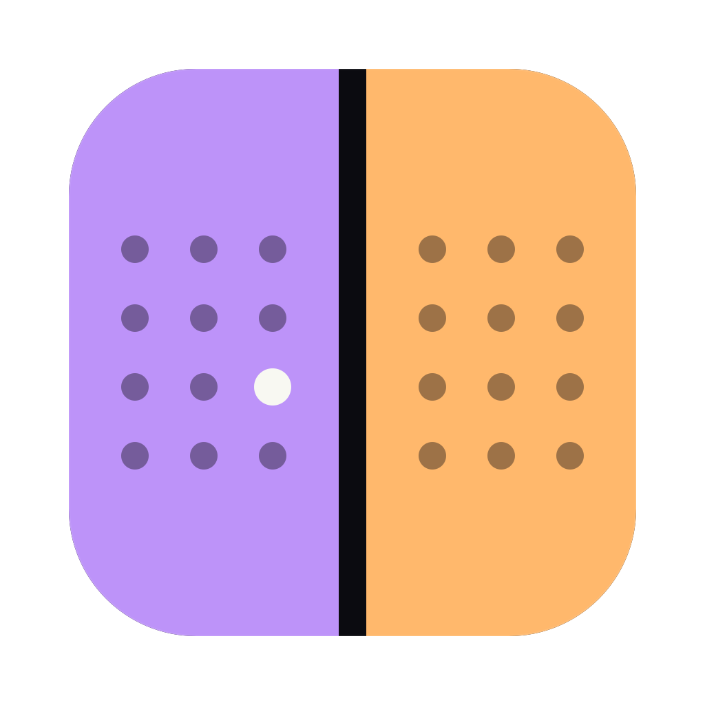

<div align="center">



# Mysticals

One calendar for all your accounts, where every account stays in its own box.

[Website](https://mysticals.sashkoratushnyi.com) · [Download](https://mysticals.sashkoratushnyi.com/download) · [Install guide](https://mysticals.sashkoratushnyi.com/install)

[](https://github.com/a1exalexander/mysticals/releases/latest)
[](https://www.npmjs.com/package/mysticals)
[](LICENSE)

</div>

Mysticals is a calendar for Google and CalDAV accounts: Namecheap Private Email, iCloud, Fastmail or any CalDAV server. It comes as a desktop app and a terminal app, both for macOS, Windows and Linux. You add accounts inside the app, and each one is kept isolated from the others.

## Why

> I have a few personal calendars and a work one on Namecheap Private Email. That work account only speaks CalDAV, and on a Mac the only practical way to use CalDAV was the built-in Calendar app. I looked for something else and found nothing I enjoyed — Thunderbird can do it, but it was never for me.
>
> And Calendar worked fine. Until one day the work account dropped off — something outside the Mac broke, not Apple’s fault. But the app kept going, and started sending invites for work meetings to my colleagues from my personal address.
>
> That was the boiling point. So I built my own: one calendar for the desktop, one right in the terminal — where every account stays in its own box, and nothing crosses between them.
>
> — Oleksandr Ratushnyi

So Mysticals guarantees:

- No default account or calendar. Every new event needs an explicit account and calendar.
- Events are never copied, moved or re-created across accounts.
- RSVPs go out only through the account that received the invite.
- Each account has its own encrypted credentials, cache and sync.
- Attendees are never added automatically.

## Install

### Desktop

Download the latest build from [GitHub Releases](https://github.com/a1exalexander/mysticals/releases/latest):

- **macOS**: `.dmg` (Apple Silicon `arm64` or Intel `x64`). The app is unsigned: on first launch, right-click it and choose **Open**.
- **Windows**: `-setup.exe`. SmartScreen warns about an unknown publisher: **More info → Run anyway**.
- **Linux**: `.AppImage` or `.deb`. Storing credentials needs a running keyring (GNOME Keyring, KWallet).

### Terminal

Needs Node.js 20.3 or newer.

```sh
npm i -g mysticals
mysticals   # press ? for keys
```

Full docs: [apps/terminal/README.md](apps/terminal/README.md).

### Try it without accounts

Two fake, isolated accounts, no network:

```sh
MYSTICALS_MOCK=1 mysticals
```

In PowerShell: `$env:MYSTICALS_MOCK=1; mysticals`

## Adding a CalDAV account

**Add calendar → CalDAV**, pick a preset, then enter your full email address and an app password (not your main password):

- **Namecheap Private Email**: create an application password in Private Email webmail. The server `https://dav.privateemail.com/dav.php/` is filled in.
- **iCloud**: app-specific password from [appleid.apple.com](https://appleid.apple.com).
- **Fastmail**: app password from Settings → Privacy & Security.
- Any other server: choose **Custom** and enter its URL.

## Contributing

Issues and pull requests are welcome. See [CONTRIBUTING.md](CONTRIBUTING.md) for setup, and [apps/terminal/README.md](apps/terminal/README.md) for the terminal app.

## License

[MIT](LICENSE)
